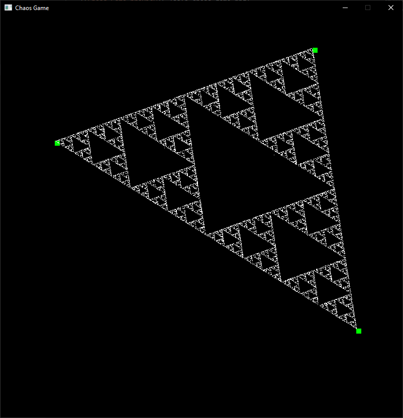

# Chaos Game


In short, a Chaos Game creates fractals using the following method:
  1) Draw a set of vertices placed at random in a 2D space.
  2) Draw a dot at a random point on the 2D surface.
  3) Choose a random vertex, and on a line that connects the dot and the vertex, draw a point where the point is of equal distance to the vertex as of the dot. Repeat this step forever.

For more information on why this simple algorithm creates beautiful fractals, see http://www.sfu.ca/~rpyke/chaosgame.pdf

This method is also fun to do yourself using a piece of paper and a marker.
Using three vertices will produce a nice fractal most of the time.

## Running
This is a Rust application. If you have [cargo](https://doc.rust-lang.org/cargo/), just run
```bash
cargo run
```
in the root directory. Else, ask your parents to create a runnable binary of this application for your system architecture.